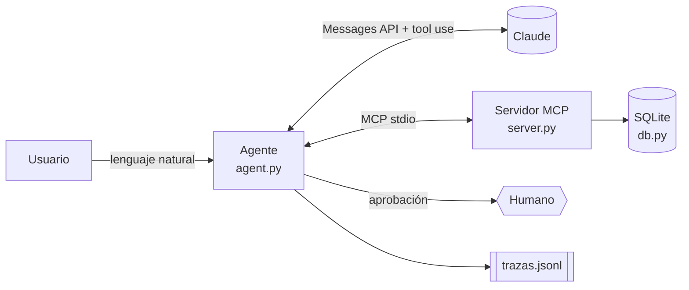

# finanzas-agent

Servidor **MCP** de finanzas personales y un **agente con Claude** que lo opera en lenguaje
natural, con confirmación humana para acciones destructivas, evals automáticos y trazas
de costo y latencia.

> «Gasté 12.50 en un café» → registra el gasto · «¿Me pasé de algún presupuesto?» → consulta y explica.

## Arquitectura



| Capa | Archivo | Responsabilidad |
|---|---|---|
| Datos | `src/finanzas_agent/db.py` | SQL, validación. Sin LLM ni MCP: se testea aislada |
| Herramientas | `src/finanzas_agent/server.py` | 6 tools MCP con esquemas tipados (Pydantic) |
| Agente | `src/finanzas_agent/agent.py` | Bucle de tool use, límite de pasos, HITL, métricas |
| Interfaz | `src/finanzas_agent/cli.py` | Chat en terminal |
| Evals | `evals/` | Casos YAML verificados contra el estado real de la BD |

## Decisiones de diseño

- **MCP en vez de tools hardcodeadas.** El servidor sirve también para Claude Desktop o Claude Code;
  el agente descubre las herramientas en tiempo de ejecución.
- **Bucle manual.** Las tools vienen de MCP y se necesita control explícito sobre el tope de pasos,
  la aprobación humana y la contabilidad de tokens.
- **Human-in-the-loop.** `eliminar_gasto` nunca se ejecuta sin aprobación (`REQUIERE_CONFIRMACION`).
  Si se rechaza, el modelo recibe un `tool_result` con error y no lo reintenta.
- **Defensa contra prompt injection.** El system prompt trata la salida de las tools como datos.
  Hay un eval específico con una descripción maliciosa.
- **Errores como datos.** Los fallos de validación vuelven al modelo como `is_error` para que se corrija solo.
- **Historial append-only.** Nunca se reescriben turnos previos, lo que mantiene válidos el caché y el razonamiento.
- **Fallback por rechazo.** Se usa `fallbacks="default"` del lado del servidor.

## Uso

```bash
python -m venv .venv && source .venv/bin/activate   # Windows: .venv\Scripts\activate
pip install -e ".[dev]"
cp .env.example .env   # añade tu ANTHROPIC_API_KEY
finanzas-chat
```

### Usar el servidor desde Claude Desktop / Claude Code

```json
{
  "mcpServers": {
    "finanzas": {
      "command": "python",
      "args": ["-m", "finanzas_agent.server"],
      "env": { "FINANZAS_DB": "/ruta/a/finanzas.db" }
    }
  }
}
```

## Tests y evals

```bash
pytest -q                      # unitarios + integración MCP (sin API)
python evals/run_evals.py      # agente real contra casos.yaml (cuesta dinero)
```

Cada caso parte de una BD limpia con semilla y verifica: herramientas llamadas o prohibidas,
contenido de la respuesta, **estado final de la BD vía SQL** y número de pasos.

### Resultados

<!-- Pega aquí la salida de evals/resultados/ultimo.json -->
| Métrica | Valor |
|---|---|
| Tasa de éxito | _pendiente_ |
| Latencia p50 / p95 | _pendiente_ |
| Costo medio por tarea | _pendiente_ |

## Fallos y aprendizajes

_Documenta aquí los casos que falla el agente y qué cambiaste (prompt, descripción de tools, validación)._

## Roadmap

- [ ] Postgres + pgvector (búsqueda semántica de gastos por descripción)
- [ ] Langfuse / OpenTelemetry en lugar de `trazas.jsonl`
- [ ] Transporte MCP HTTP + autenticación
- [ ] API FastAPI con streaming y frontend Next.js
- [ ] Importación de extractos bancarios (CSV / PDF)
- [ ] Más evals: conversaciones multi-turno, fechas relativas («ayer», «la semana pasada»)
